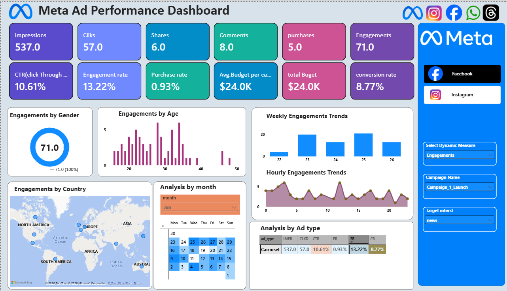
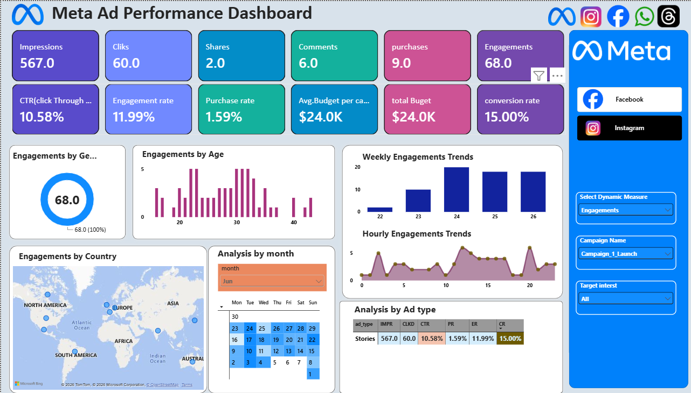

# 📊 Meta Ad Performance Dashboard | Power BI

An interactive **Meta Ad Performance Dashboard** built using Microsoft Power BI to analyze advertising performance, audience engagement, campaign metrics, conversions, and trends.

---

## 📸 Dashboard Preview



### 🔎 Filtered Dashboard View



---

## 🎯 Project Objective

The objective of this project is to transform raw Meta advertising data into an interactive business intelligence dashboard.

The dashboard helps analyze:

- Advertising reach and impressions
- Click performance
- Audience engagement
- Purchases and conversions
- Campaign performance
- Ad type performance
- Audience demographics
- Geographic engagement
- Weekly and hourly trends

---

## 📌 Key KPIs

The dashboard tracks the following important performance indicators:

| KPI | Description |
|---|---|
| Impressions | Total number of times ads were displayed |
| Clicks | Total clicks generated by advertisements |
| Shares | Number of times advertisements were shared |
| Comments | Total comments generated |
| Purchases | Number of purchases generated |
| Engagements | Total user interactions |
| CTR | Click Through Rate |
| Engagement Rate | Engagement compared with impressions |
| Purchase Rate | Purchases compared with impressions |
| Conversion Rate | Purchases generated from clicks |
| Total Budget | Total advertising budget |
| Average Campaign Budget | Average budget allocated per campaign |

---

## 📊 Dashboard Features

### 1. Campaign Performance

Analyze campaign-level performance using:

- Impressions
- Clicks
- Engagements
- Purchases
- CTR
- Conversion Rate

### 2. Audience Analysis

The dashboard provides audience insights based on:

- Age
- Gender
- Target Interest

### 3. Geographic Analysis

An interactive map is used to visualize engagement across different countries and regions.

### 4. Time-Based Analysis

The dashboard provides:

- Weekly engagement trends
- Hourly engagement trends
- Monthly analysis

### 5. Ad Type Analysis

Compare advertising performance across different ad formats such as:

- Stories
- Carousel
- Other ad types

### 6. Interactive Filters

Users can dynamically filter the dashboard using:

- Campaign Name
- Target Interest
- Month
- Dynamic Measure Selection

---

## 🧮 Key Metrics

### Click Through Rate (CTR)

CTR measures the percentage of impressions that resulted in clicks.

**Formula:**

`CTR = (Clicks / Impressions) × 100`

### Engagement Rate

Measures audience engagement relative to impressions.

**Formula:**

`Engagement Rate = (Engagements / Impressions) × 100`

### Purchase Rate

Measures purchases relative to impressions.

**Formula:**

`Purchase Rate = (Purchases / Impressions) × 100`

### Conversion Rate

Measures the percentage of clicks that resulted in purchases.

**Formula:**

`Conversion Rate = (Purchases / Clicks) × 100`

---

## 🛠️ Tools & Technologies

- **Microsoft Power BI**
- **Power Query**
- **DAX**
- **Data Modeling**
- **Data Cleaning**
- **Data Visualization**
- **CSV Data**

---

## 📂 Dataset

The project uses the following datasets:

```text
ad_events.csv
ads.csv
campaigns.csv
users.csv
```

The datasets were imported into Power BI and transformed using Power Query before creating the dashboard.

---

## 🔄 Project Workflow

```text
Raw Data
   ↓
Data Import
   ↓
Data Cleaning & Transformation
   ↓
Data Modeling
   ↓
DAX Measures
   ↓
Dashboard Development
   ↓
Interactive Analysis
   ↓
Business Insights
```

---

## 💡 Business Use Cases

This dashboard can help marketing teams and analysts:

- Monitor advertising campaign performance
- Identify engagement patterns
- Analyze audience behavior
- Compare different ad formats
- Track CTR and conversion performance
- Analyze geographic engagement
- Monitor campaign trends
- Support data-driven marketing decisions

---

## 📁 Repository Structure

```text
Meta-Ad-Performance-PowerBI-Dashboard/
│
├── Dashboard Insights.pdf
├── Meta Ad performance Dashboard.pbix
│
├── dashboard-overview.png.png
├── dashboard-filtered-view.png.png
│
├── ad_events.csv
├── ads.csv
├── campaigns.csv
├── users.csv
│
└── README.md
```

---

## 📄 Project Files

### Power BI Dashboard

`Meta Ad performance Dashboard.pbix`

The main Power BI dashboard file containing the data model, DAX measures, visualizations, filters, and dashboard design.

### Dashboard Report

`Dashboard Insights.pdf`

PDF version of the dashboard for quick viewing and presentation.

---

## 👨‍💻 Author

### Sunil Patil

**B.Tech Computer Engineering**

Aspiring **Data Analyst**

### Skills

`Power BI` `SQL` `Python` `Excel` `Data Analysis` `DAX` `Power Query`

---

## ⭐ Project Highlights

- Interactive Power BI dashboard
- KPI-based performance analysis
- Campaign analysis
- Audience demographic analysis
- Geographic visualization
- Time-series analysis
- Dynamic filtering
- DAX-based calculations
- Business-focused data visualization

---

## 📌 Conclusion

The **Meta Ad Performance Dashboard** demonstrates how raw advertising data can be transformed into an interactive business intelligence solution using Power BI.

The dashboard provides a consolidated view of campaign performance and enables users to explore advertising data through interactive KPIs, charts, maps, filters, and trend analysis.
